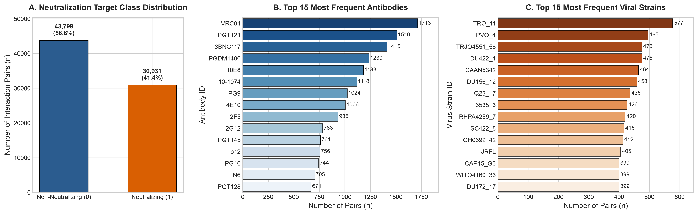
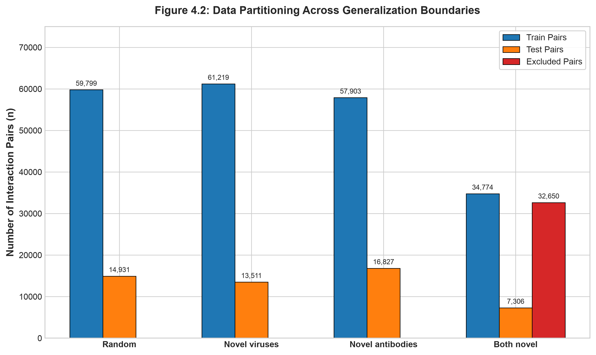
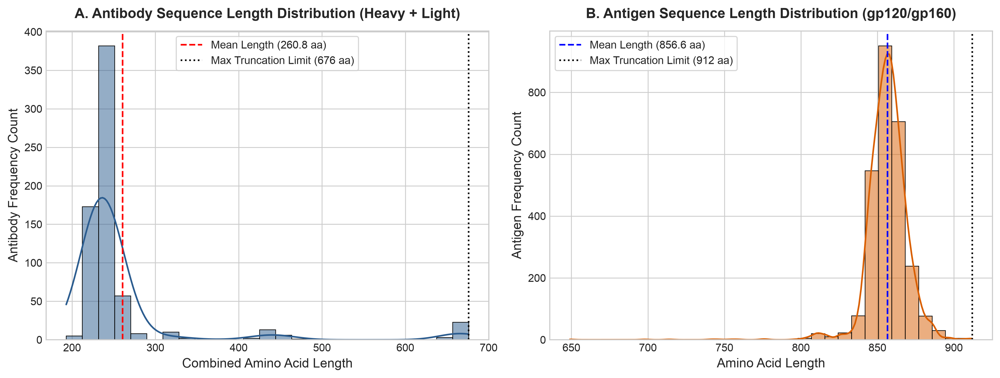
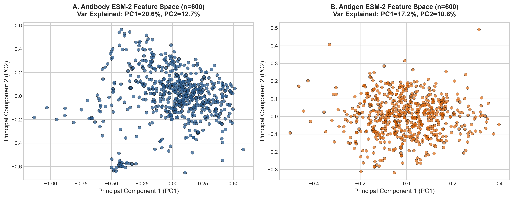
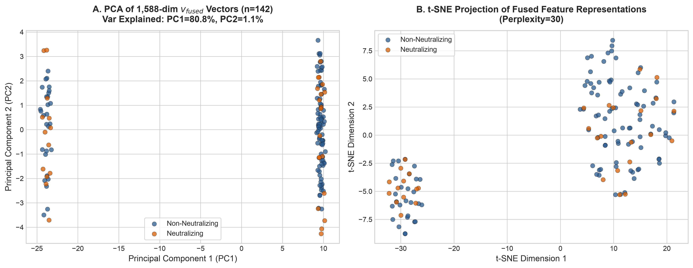
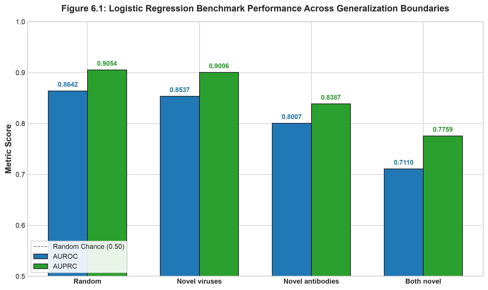
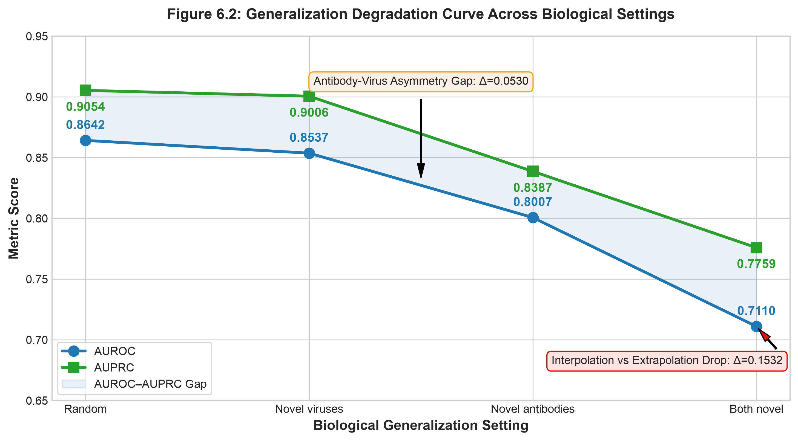
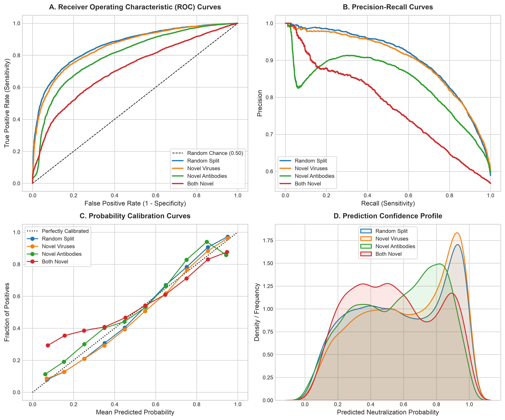

# ESM-Mamba + Logistic Regression (`esm-up`): Modular Baseline Pipeline

A modular computational pipeline for evaluating ESM-Mamba biophysical feature representations ($v_{\text{fused}}$) under four distinct biological generalization boundaries using L2-regularized Logistic Regression.

---

## 📌 Executive Summary & Methodology

This repository establishes a baseline classifier by extracting 1,588-dimensional fused biophysical interaction vectors ($v_{\text{fused}}$) generated by the **ESM-Mamba (MambaCross)** architecture and fitting an L2-regularized **Logistic Regression** classifier (`LogisticRegressionCV` with 5-fold cross-validation across $C \in [10^{-3}, 10^2]$).

### Feature Extraction Pipeline:
1. **Phase A (ESM-2 Embeddings)**: Sequence representations generated using `esm2_t6_8M_UR50D` (320 dimensions per residue).
2. **Phases B–D ($v_{\text{fused}}$ Fusion)**: Sequence embeddings are projected via an untrained bilinear matrix $W \in \mathbb{R}^{320 \times 320}$, swept using 2D Selective State Space Models (**VMamba**), and pooled into a static 1,588-dimensional feature vector ($v_{\text{fused}}$) per antibody-antigen pair.
3. **Classification**: Features are standard-scaled (`StandardScaler` fitted on training split only) and fitted using L2 Logistic Regression.

---

## 🔬 Generalization Experiments & Dataset Partitioning

The complete dataset contains **74,730 HIV antibody–antigen interaction pairs**. The data is partitioned across four distinct generalization settings to evaluate model capability from simple interpolation to strict bi-directional extrapolation:

| # | Experiment | Generalization Boundary | Description & Biological Context | Train Pairs ($n$) | Test Pairs ($n$) | Excluded Pairs ($n$) | Held-out Entities |
|---|---|---|---|---|---|---|---|
| **1** | **Random Split** | **Interpolation Baseline** | Row-level random 80/20 split. Entities overlap between train and test in different pair combinations. Tests feature classification capacity. | 59,799 (80.0%) | 14,931 (20.0%) | 0 | None |
| **2** | **Novel Viruses** | **Antigen Holdout** | **541 unique viral strains** are completely held out from training. Evaluates zero-shot prediction on emerging viral variants. | 61,219 (81.9%) | 13,511 (18.1%) | 0 | 541 Viruses |
| **3** | **Novel Antibodies** | **Antibody Holdout** | **137 unique antibodies** are completely held out from training. Evaluates zero-shot prediction on novel candidate therapeutics. | 57,903 (77.5%) | 16,827 (22.5%) | 0 | 137 Antibodies |
| **4** | **Both Novel** | **Bi-directional Extrapolation** | Both antibody (**232**) and virus (**749**) in test pairs are completely unseen in training. **32,650 single-novel overlap pairs are excluded** to eliminate leakage. | 34,774 (46.5%) | 7,306 (9.8%) | 32,650 (43.7%) | 232 Abs & 749 Vir |

---

## 📊 Benchmark Results Summary

The performance of L2 Logistic Regression on cached $v_{\text{fused}}$ vectors across all four generalization boundaries:

| Experiment | Train $n$ | Test $n$ | Test % Neutralizing | AUROC | AUPRC | Best $C$ | Held-out Abs | Held-out Viruses | Excluded Pairs |
| :--- | :---: | :---: | :---: | :---: | :---: | :---: | :---: | :---: | :---: |
| **Random Split** | 59,799 | 14,931 | 58.88% | **0.8642** | **0.9054** | 0.001 | N/A | N/A | N/A |
| **Novel Viruses** | 61,219 | 13,511 | 60.38% | **0.8537** | **0.9006** | 0.001 | N/A | 541 | N/A |
| **Novel Antibodies** | 57,903 | 16,827 | 59.67% | **0.8007** | **0.8387** | 0.001 | 137 | N/A | N/A |
| **Both Novel** | 34,774 | 7,306 | 56.78% | **0.7110** | **0.7759** | 0.001 | 232 | 749 | 32,650 |

### Key Experimental Insights:
1. **Interpolation vs Extrapolation Gap**: Performance drops from **0.8642 AUROC** in the random interpolation baseline down to **0.7110 AUROC** under strict double holdout (Experiment 4).
2. **Antibody vs Virus Asymmetry**: Generalizing to unseen viruses (Exp 2: **0.8537 AUROC**) is significantly easier than generalizing to unseen antibodies (Exp 3: **0.8007 AUROC**), indicating that antibody feature representations exhibit higher sequence diversity and specificity requirements.

---

## 📈 Thesis Data Visualization Suite

A clean, modular visualization engine is located in `/visualizations/`. All figures are rendered at **300 DPI (PNG)** for high-resolution graphics and as **vector PDFs** for LaTeX integration.

### Figure Inventory & Embedded Gallery:

| Figure # | Script | Output Files | Description |
| :---: | :--- | :--- | :--- |
| **Figure 4.1** | [`fig1_dataset_distribution.py`](visualizations/fig1_dataset_distribution.py) | `fig4_1_dataset_distribution.png / .pdf` | Class balance (58.9% neutralizing) and entity frequency distribution |
| **Figure 4.2** | [`fig2_partition_splits.py`](visualizations/fig2_partition_splits.py) | `fig4_2_partition_splits.png / .pdf` | Train ($n_{\text{train}}$), Test ($n_{\text{test}}$), and Excluded pair counts per split |
| **Figure 4.3** | [`fig3_sequence_lengths.py`](visualizations/fig3_sequence_lengths.py) | `fig4_3_sequence_lengths.png / .pdf` | Sequence length distributions for Heavy+Light antibodies and antigens |
| **Figure 4.4** | [`fig4_esm_embedding_pca.py`](visualizations/fig4_esm_embedding_pca.py) | `fig4_4_esm_embedding_pca.png / .pdf` | 2D PCA projection of raw 320-dim ESM-2 sequence embeddings |
| **Figure 5.1** | [`fig5_fused_feature_pca.py`](visualizations/fig5_fused_feature_pca.py) | `fig5_1_fused_feature_pca.png / .pdf` | PCA & t-SNE projections of 1,588-dim $v_{\text{fused}}$ biophysical vectors |
| **Figure 6.1** | [`fig6_benchmark_performance.py`](visualizations/fig6_benchmark_performance.py) | `fig6_1_benchmark_performance.png / .pdf` | Benchmark performance comparison (AUROC & AUPRC across 4 splits) |
| **Figure 6.2** | [`fig7_generalization_degradation.py`](visualizations/fig7_generalization_degradation.py) | `fig6_2_generalization_degradation.png / .pdf` | Generalization degradation curve and antibody-vs-virus asymmetry gap |
| **Figure 6.3** | [`fig8_model_diagnostics.py`](visualizations/fig8_model_diagnostics.py) | `fig6_3_model_diagnostics.png / .pdf` | ROC curves, Precision-Recall curves, Calibration, & Confidence profiles |

To run all figure generation scripts sequentially:
```bash
python3 visualizations/run_all_visualizations.py
```

---

### 🖼️ Thesis Visualizations Gallery

#### Figure 4.1 — Dataset Composition & Target Class Distribution

*Figure 4.1: Target class balance ($58.9\%$ neutralizing) and representation counts for top antibodies and viral strains.*

#### Figure 4.2 — Generalization Partitioning & Data Split Breakdown

*Figure 4.2: Train, Test, and Excluded pair counts across the four experiment splits.*

#### Figure 4.3 — Sequence Length Distribution of Antibodies and Antigens

*Figure 4.3: Sequence length distribution for Heavy+Light antibody chains and gp120/gp160 antigens.*

#### Figure 4.4 — Principal Component Analysis (PCA) of ESM-2 Sequence Embeddings

*Figure 4.4: 2D PCA projections of 320-dimensional mean-pooled ESM-2 embeddings for antibodies and antigens.*

#### Figure 5.1 — Dimensionality Reduction (PCA & t-SNE) of 1,588-dim $v_{\text{fused}}$ Vectors

*Figure 5.1: Low-dimensional feature projections of fused biophysical interaction representations colored by class.*

#### Figure 6.1 — Benchmark Performance Comparison Across Generalization Boundaries

*Figure 6.1: Comparative AUROC and AUPRC performance scores across all four experiment settings.*

#### Figure 6.2 — Generalization Degradation Curve & Entity Holdout Asymmetry

*Figure 6.2: Degradation of predictive power across biological settings highlighting antibody vs virus asymmetry.*

#### Figure 6.3 — Model Diagnostic Profiles (ROC, PR, Calibration, & Confidence)

*Figure 6.3: Comprehensive model diagnostics showing ROC curves, PR curves, calibration, and prediction confidence distributions.*

---

## 📂 Repository Layout

```
esm-up/
├── Data/HIV/                 # Raw sequence tables (antibody.csv, antigen.csv)
├── docs/                     # Documentation and scientific methodology notes
│   ├── methodology_explanation.txt
│   ├── pipeline_documentation.txt
│   ├── scientific_review.txt
│   └── legacy_results/
│
├── shared/                   # Core reusable modules, models, and shared cache
│   ├── Models.py             #   MambaCross model (Bilinear projection & 2D VMamba sweeps)
│   ├── Pretrained.py         #   ESM-2 sequence embedding extractor
│   ├── Toolkit.py            #   Evaluation metrics & helper functions
│   ├── Loader.py             #   Pair dataset loader
│   ├── Param_Model.json      #   Model hyperparameters
│   ├── cleaned_dataset.csv   #   Base dataset (all 74,730 interaction pairs)
│   └── v_fused_cache/        #   Cached 1,588-dim feature representations
│
├── visualizations/           # 📈 Modular thesis visualization scripts & figures
│   ├── fig1_dataset_distribution.py
│   ├── fig2_partition_splits.py
│   ├── fig3_sequence_lengths.py
│   ├── fig4_esm_embedding_pca.py
│   ├── fig5_fused_feature_pca.py
│   ├── fig6_benchmark_performance.py
│   ├── fig7_generalization_degradation.py
│   ├── fig8_model_diagnostics.py
│   ├── run_all_visualizations.py
│   └── figures/              #   Exported 300 DPI PNG & vector PDF figure artifacts
│
├── experiment_1_random/      # Exp 1: Random Split (59,799 train / 14,931 test)
├── experiment_2_novel_viruses/ # Exp 2: Novel Viruses (61,219 train / 13,511 test)
├── experiment_3_novel_antibodies/ # Exp 3: Novel Antibodies (57,903 train / 16,827 test)
├── experiment_4_both_novel/  # Exp 4: Both Novel (34,774 train / 7,306 test)
├── extract_vfused_cache.py   # Computes & caches Phase B-D v_fused vectors
├── run_all_experiments.py    # Master runner (fits LR across all 4 experiments)
├── run_pipeline.sh           # End-to-end orchestration shell script
├── summary_results.csv       # Consolidated performance table (generated)
└── requirements.txt          # Python dependencies
```

---

## ⚡ Execution Instructions

### 1. Environment Setup
```bash
python3 -m venv .venv
source .venv/bin/activate     # Linux/macOS
# .venv\Scripts\activate      # Windows
pip install -r requirements.txt
```

### 2. End-to-End Orchestrated Run
```bash
chmod +x run_pipeline.sh
./run_pipeline.sh
```

### 3. Step-by-Step Manual Execution

#### Step 3.1: Extract ESM-2 Sequence Embeddings (Phase A)
```bash
python3 shared/Pretrained.py
```
Runs `esm2_t6_8M_UR50D` to generate `.npy` embeddings for all antibodies and antigens under `Outputs/Pretrained_HIV/`.

#### Step 3.2: Cache $v_{\text{fused}}$ Representation Vectors (Phases B–D)
```bash
python3 extract_vfused_cache.py
```
Runs bilinear projection and VMamba sequence sweeps over ESM-2 embeddings, saving 1,588-dimensional $v_{\text{fused}}$ vectors to `shared/v_fused_cache/`.

#### Step 3.3: Fit and Evaluate Logistic Regression
```bash
python3 run_all_experiments.py
```
Sequentially fits L2-regularized `LogisticRegressionCV` across all four partitions and exports consolidated metrics to `summary_results.csv`.

---

## 🔬 Standalone Experiment Execution

Each experiment folder is fully self-contained. Assuming `shared/v_fused_cache/` exists, run:

```bash
cd experiment_3_novel_antibodies
python3 train_lr.py
```
